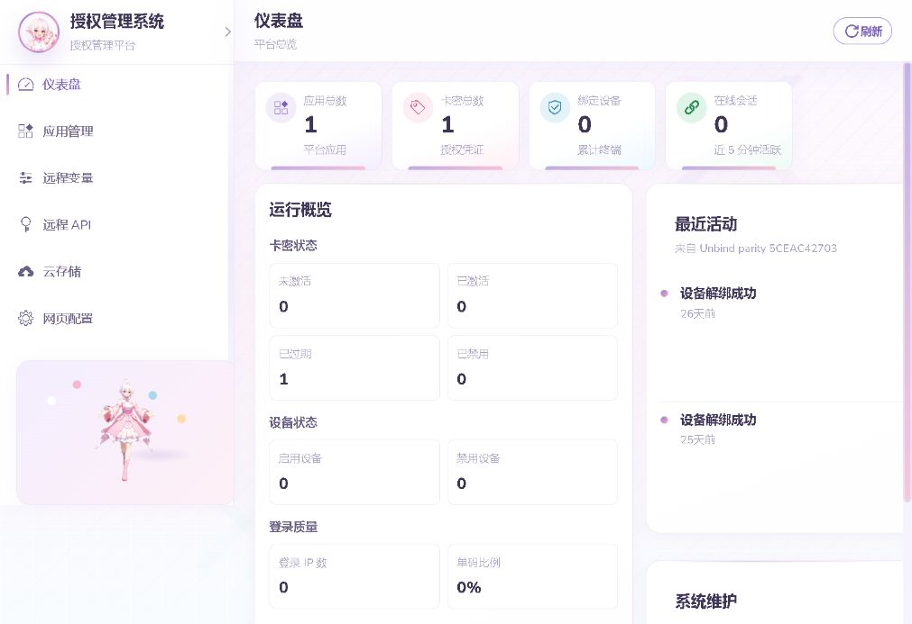
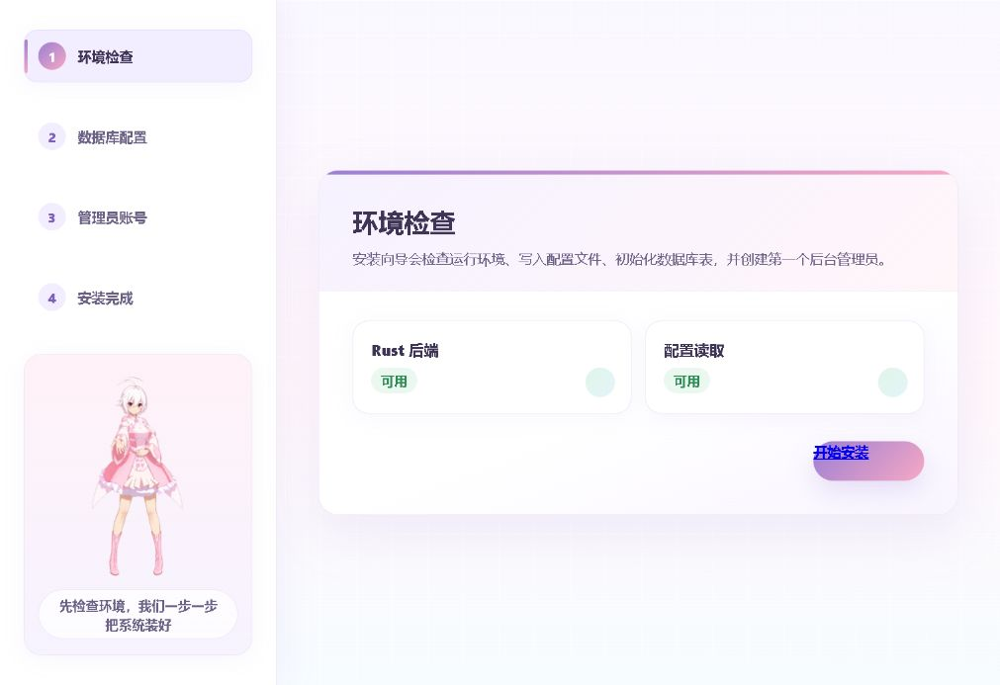

# Network Auth Rust

[](LICENSE)


Network Auth Rust 是一个使用 **Vibe Coding** 协作完成的网络授权验证平台。它把授权服务、卡密管理、设备绑定、后台控制台、远程 API、云存储分发、安装初始化和发布验证组合在一个 Rust 后端项目里，适合作为完整后端工程案例阅读、运行和二次开发。

项目使用 Axum、Tokio、SQLx 和 MySQL / MariaDB 构建，前端控制台使用原生 HTML、CSS、JavaScript 实现，采用 MIT License 开源。

## 为什么值得看

| 看点 | 说明 |
| --- | --- |
| 完整产品闭环 | 从客户端授权、后台管理、安装初始化到部署切换都有真实实现。 |
| 安全协议密度高 | 覆盖 HMAC、防重放、AES-GCM、RSA 密钥封装、P256 设备签名和敏感配置加密。 |
| 工程化程度高 | 包含 schema、SDK 模板、本地验证、开源审计脚本、发布 smoke、readiness gate 和回滚脚本。 |
| 适合简历展示 | 不是单点 demo，而是可以展示后端设计、系统安全、运维发布和自动化验证的综合项目。 |

## 预览

截图来自本地 Rust 后端和 MariaDB 数据库运行环境。

| 后台控制台 | 安装向导 |
| --- | --- |
|  |  |

## 功能

- 客户端授权：登录挑战、卡密登录、心跳、解绑、远程配置、远程变量、云下载票据和安全上报。
- 管理后台：应用、卡密、设备、账号、消息、审计日志、站点配置、远程 API Token 和云存储文件管理。
- 安全协议：HMAC 请求签名、防重放 nonce、AES-GCM 加密载荷、RSA 密钥封装、P256 设备签名和后台会话签名。
- 云存储：本地存储、阿里云 OSS、腾讯云 COS，支持上传票据、下载 Token、签名 URL、文件列表、详情和删除。
- 安装初始化：schema 初始化、运行时补丁检查、管理员创建、数据库预检和安装锁。
- 工程化发布：release package check、smoke gate、readiness gate、Nginx 切换、systemd unit 和回滚脚本。
- 自动化验证：Rust 单测、PHP 黑盒回归脚本、live smoke、发布脚本自测和预检命令。

## 技术栈

| 模块 | 技术 |
| --- | --- |
| 后端 | Rust, Axum, Tokio, Tower HTTP |
| 数据库 | MySQL / MariaDB, SQLx |
| 加密 | AES-GCM, AES-CBC, RSA, P256 ECDSA, HMAC, SHA-256 |
| 前端 | HTML, CSS, JavaScript |
| 运维 | Nginx, systemd, Bash, PowerShell |
| 验证 | Rust tests, PHP smoke scripts, release gates |

## 架构

```text
Browser / SDK / Remote API
        |
        v
Axum HTTP Router
        |
        +-- service/       业务编排：客户端授权、后台、登录、远程 API、云存储
        +-- repository/    SQLx MySQL 数据访问
        +-- crypto/        加密、签名、token、密钥工具
        +-- install.rs     安装初始化、schema 检查、运行时补丁
        +-- deploy.rs      项目预检、release storage 检查
        |
        v
MySQL / MariaDB
```

仓库主要目录：

```text
src/          Rust 后端源码
public/       管理后台、登录页、安装器静态资源
resources/    数据库 schema、SDK 模板和示例
scripts/      本地回归、smoke、readiness 检查脚本
deploy/       Nginx、systemd、打包、切换和回滚脚本
docs/         架构、部署和维护文档
```

## 快速开始

### 环境要求

- Rust stable
- MySQL 8.0+ 或 MariaDB 10.6+
- PowerShell、Bash 或兼容 shell
- PHP CLI，仅在运行 PHP 黑盒回归脚本时需要

### 1. 创建数据库

```sql
CREATE DATABASE network_auth DEFAULT CHARACTER SET utf8mb4 COLLATE utf8mb4_unicode_ci;
CREATE USER 'network_auth'@'127.0.0.1' IDENTIFIED BY 'change-me';
GRANT ALL PRIVILEGES ON network_auth.* TO 'network_auth'@'127.0.0.1';
FLUSH PRIVILEGES;
```

### 2. 创建本地配置

```powershell
Copy-Item config/local.example.php config/local.php
```

编辑 `config/local.php`，填写数据库地址、端口、账号、密码、库名和系统密钥。该文件已被 `.gitignore` 排除，请只保留在本地或部署环境中。

### 3. 初始化数据库

```powershell
cargo run -- migrate --dry-run --config config/local.php
cargo run -- migrate --config config/local.php
```

### 4. 启动服务

```powershell
cargo run -- serve --listen 127.0.0.1:8080 --config config/local.php
```

启动后访问：

- `http://127.0.0.1:8080/health`
- `http://127.0.0.1:8080/install/`
- `http://127.0.0.1:8080/admin/login/`

### 5. 运行预检

```powershell
cargo run -- preflight --config config/local.php --database --public-root public --schema resources/install/schema.sql --storage-root storage
```

## 常用命令

```powershell
cargo fmt --check
cargo check -j1
cargo test -j1 --lib
.\scripts\openSourceAudit.ps1
cargo run -- migrate --dry-run --config config/local.php
cargo run -- preflight --strict --config config/local.php --database
```

发布相关命令位于 `deploy/scripts/`，Linux 部署流程见 [docs/deployment.md](docs/deployment.md)。

## 配置说明

运行配置采用 PHP 风格配置文件，便于在传统虚拟主机、PHP 项目目录和 Rust 后端之间共享配置形态。建议从 [config/local.example.php](config/local.example.php) 复制出本地文件，再按环境填写真实值。

关键配置包括：

- 数据库连接：host、port、user、password、database
- 系统密钥：用于敏感配置加密和签名派生
- 站点资源：public root、storage root、schema path
- 运行模式：演示模式、安装锁、日志级别

## 安全设计

- 后台接口使用 session token、时间戳、nonce 和 HMAC 签名。
- 远程 API 使用 access key、加密 secret、签名请求、防重放 nonce 和可选 IP 白名单。
- 客户端协议支持加密载荷、RSA 密钥封装、AES-GCM、设备本地密钥和 P256 签名。
- 云厂商 Secret 加密落库，不以明文回显。
- 演示模式会阻止高风险写操作。

安全报告和漏洞披露方式见 [SECURITY.md](SECURITY.md)。

## 项目文档

- [架构说明](docs/architecture.md)
- [部署说明](docs/deployment.md)
- [贡献指南](CONTRIBUTING.md)
- [安全策略](SECURITY.md)
- [支持说明](SUPPORT.md)
- [行为准则](CODE_OF_CONDUCT.md)
- [第三方声明](THIRD_PARTY_NOTICES.md)
- [更新日志](CHANGELOG.md)
- [维护检查清单](docs/openSourceChecklist.md)

## 公开发布

如果本地仓库曾经保存过私有部署记录、真实凭据或运行日志，请不要直接推送旧历史。推荐从当前公开文件树创建干净分支或新仓库后再发布，并在发布前运行：

```powershell
.\scripts\openSourceAudit.ps1 -CurrentHistory
```

## 许可证

本项目使用 [MIT License](LICENSE) 开源。第三方资源按其各自许可证授权，详见 [THIRD_PARTY_NOTICES.md](THIRD_PARTY_NOTICES.md)。
